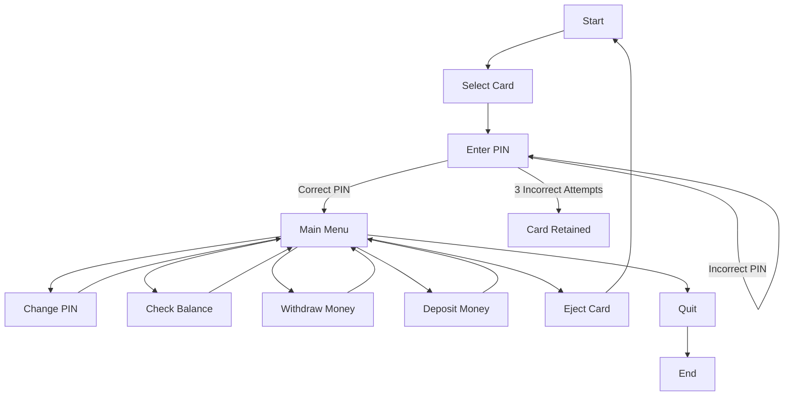

# ATM Simulator

## Project Description
The ATM Simulator is a console-based application written in the C programming language. This program simulates basic ATM functionalities, allowing users to interact with the system using two pre-configured cards. Users can select a card, enter their PIN, and perform various transactions such as checking the balance, changing the PIN, withdrawing, and depositing money.

## Features
- Card Selection: Users can select one of two available cards.
- PIN Verification: Users must enter the correct PIN to access the ATM features. Each card allows up to three attempts before it is locked.
- Change PIN: Users can change the PIN of the selected card.
- Check Balance: Users can view the current balance of the selected card.
- Withdraw Money: Users can withdraw money from the selected card, but only in multiples of 5, 10, or 20.
- Deposit Money: Users can deposit money into the selected card.
- Eject Card: Users can eject the current card and select another.
- Quit Program: Users can quit the program at any time.

## Getting Started

### Prerequisites
To compile and run this program, you need a C compiler such as gcc.

### Installation
1. Clone the repository:
    ```sh
    git clone https://github.com/yourusername/ATM_Simulator.git
    cd ATM_Simulator
    ```

2. Compile the program:
    ```sh
    gcc -o atm_simulator atm_simulator.c
    ```

3. Run the program:
    ```sh
    ./atm_simulator
    ```
    
## Usage
After running the program, follow the on-screen prompts to perform various ATM transactions. Below are the steps to use the ATM Simulator:

1. Select Card:
    - Enter 1 or 2 to select one of the two cards.

2. Enter PIN:
    - Enter the 4-digit PIN associated with the selected card. You have up to three attempts to enter the correct PIN.

3. Choose an Option:
    - 1. Change PIN - Change the PIN of the selected card.
    - 2. Check Balance - View the current balance of the selected card.
    - 3. Withdraw Money - Withdraw money in multiples of 5, 10, or 20.
    - 4. Deposit Money - Deposit money into the selected card.
    - 5. Eject Card - Eject the current card and return to the card selection screen.
    - 6. Quit - Exit the program.

### Example Session
```plaintext
Select Card (1 or 2): 1
Enter PIN: 1234
1. Change PIN
2. Check Balance
3. Withdraw Money
4. Deposit Money
5. Eject Card
6. Quit
Select an option: 2
Current balance: £1234.60
```

### Diagram



## Author
- Bilol
- GitHub Profile: [Chinilshik-kalkulatorov](https://github.com/Chinilshik-kalkulatorov)
